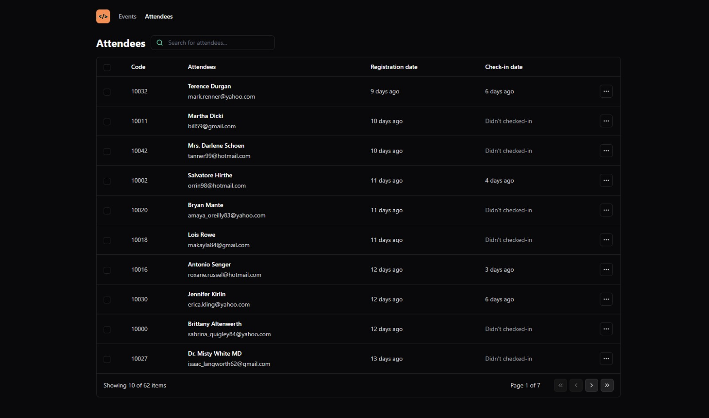
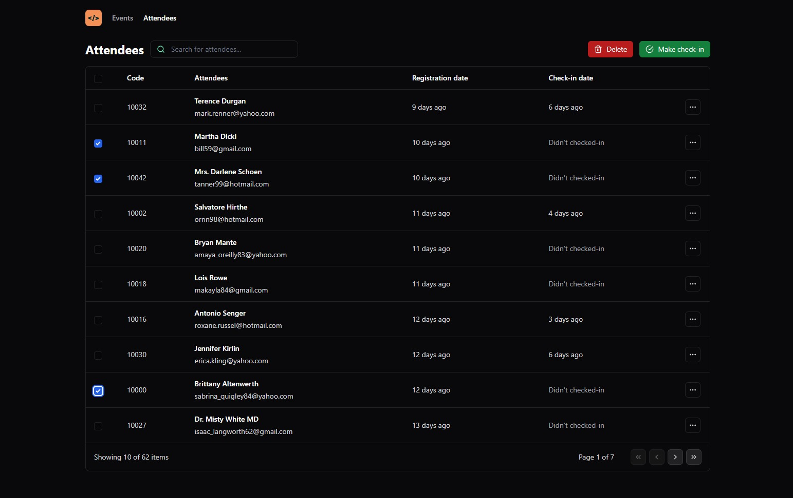

# Pass-in
The Pass-in is an application **managing attendees in in-person events**.

## ⚙️ Functionalities
### Back-end:
* The tool allows the organizer to register an event and open public registration page.

* Registered attendees can generate a credential for check-in on the day of the event.

* The system will scan the participant's credential to allow entry to the event.

### Front-end:
* view all attendees in the event.

* Manage attendees.

## 💻 Tecnologias


Fastify, Node.js, React, Typescript, Tailwindcss, Prisma, SQLite.


## 🚀 Getting Started
To reproduce the project locally, follow these steps:

### Pré-requisito:
* Node.js v20.11.1

#### Instalação
1. Clone this repository to your machine:
```
git clone https://github.com/GabrielMartinsss/pass-in
```
2. Navigate to the project:
```
cd pass-in
```

#### back-end
1. Navigate to back-end directory:
```
cd back-end
```
2. Install dependencies of back-end:
```
npm install
```
3. Create prisma migrations
```
npx prisma migrate dev
```
4. Send seed to database;
```
npx prisma db seed
```
5. boot the server:
```
npm run dev
```

#### front-end
1. Navigate to front-end directory:
```
cd front-end
```
2. Install dependencies of front-end:
```
npm install
```
3. Initialize server:
```
npm run dev
```

## Back-end


### Functional Requirements

- [x] The organizer must be able to register a new event;
- [x] The organizer must be able to view event data;
- [x] The organizer must be able to view the list of attendees; 
- [x] The attendee must be able to register for an event;
- [x] the attendee must be able to view their registration badge;
- [x] The attendee must be able to check-in at the event;

### Business Rules

- [x] The attendee can only register for an event once;
- [x] The attendee can only register for events with available spots;
- [x] The attendee can only check-in at an event once;

### Non-functional Requirements

- [x] Event check-in will be performed through a QRCode;

## API Documentation (Swagger)

To view the API documentation, boot the server and access the link: http://localhost:3333/docs

## Database

In this application, we will use a relational database (SQL). For development environment, we will proceed with SQLite for the ease of setup.

### Diagrama ERD


### Database Structure (SQL)

```sql
-- CreateTable
CREATE TABLE "events" (
    "id" TEXT NOT NULL PRIMARY KEY,
    "title" TEXT NOT NULL,
    "details" TEXT,
    "slug" TEXT NOT NULL,
    "maximum_attendees" INTEGER
);

-- CreateTable
CREATE TABLE "attendees" (
    "id" INTEGER NOT NULL PRIMARY KEY AUTOINCREMENT,
    "name" TEXT NOT NULL,
    "email" TEXT NOT NULL,
    "event_id" TEXT NOT NULL,
    "created_at" DATETIME NOT NULL DEFAULT CURRENT_TIMESTAMP,
    CONSTRAINT "attendees_event_id_fkey" FOREIGN KEY ("event_id") REFERENCES "events" ("id") ON DELETE RESTRICT ON UPDATE CASCADE
);

-- CreateTable
CREATE TABLE "check_ins" (
    "id" INTEGER NOT NULL PRIMARY KEY AUTOINCREMENT,
    "created_at" DATETIME NOT NULL DEFAULT CURRENT_TIMESTAMP,
    "attendeeId" INTEGER NOT NULL,
    CONSTRAINT "check_ins_attendeeId_fkey" FOREIGN KEY ("attendeeId") REFERENCES "attendees" ("id") ON DELETE RESTRICT ON UPDATE CASCADE
);

-- CreateIndex
CREATE UNIQUE INDEX "events_slug_key" ON "events"("slug");

-- CreateIndex
CREATE UNIQUE INDEX "attendees_event_id_email_key" ON "attendees"("event_id", "email");

-- CreateIndex
CREATE UNIQUE INDEX "check_ins_attendeeId_key" ON "check_ins"("attendeeId");
```

## Front-end preview


